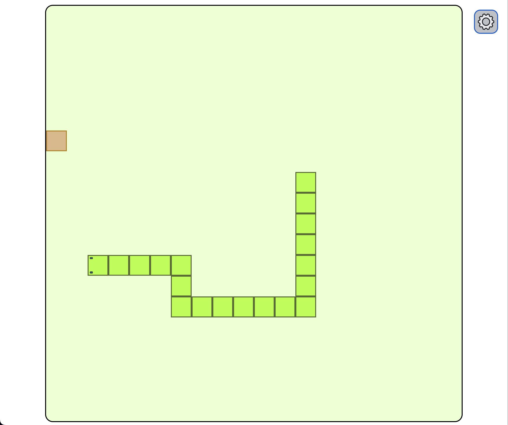
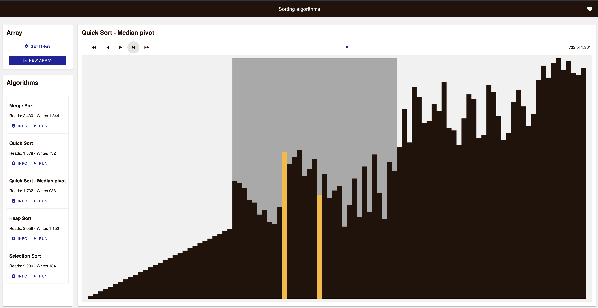

# Personal labs

This repo groups some of my personal labs. These are small projects with the following attributes:

-   learn something new by doing
-   small and concrete goals
-   do not spend more than a few days
-   not for production (not many unit tests, indulgent with trade-offs)
-   some are just for fun
-   not afraid of failing (non-finished labs are OK)
-   self-contained small project

Originally, these projects were scattered across multiple repos.

## Snake Game

This is an implementation of the [Snake game](<https://en.wikipedia.org/wiki/Snake_(video_game_genre)>) in Vanilla HTML5/CSS and TypeScript.

-   [Link to demo](https://snake-game-lab.netlify.app/)
-   Source code: [snake-game](./snake-game/README.md)
-   Main lab goals: use JavaScript [window.requestAnimationFrame()](https://developer.mozilla.org/en-US/docs/Web/API/window/requestAnimationFrame) method to animate; use the new dialog HTML element; use the new Vite for tooling.

## Sort analysis

Analysis and implementation of the most popular [sort algorithms](https://en.wikipedia.org/wiki/Sorting_algorithm) in Vanilla HTML5/CSS and TypeScript.

-   [Link to demo](https://sort-analysis.netlify.app/)
-   Source code: [sort-analysis](./sort-analysis/README.md)
-   Main lab goals: Manage the state with the [Redux](https://redux.js.org/); implement the most popular sort algorithm implementations; use [Material Design Web Components](https://github.com/material-components/material-web)

## Sudoku resolver

This little web application resolves [Sudoku](https://en.wikipedia.org/wiki/Sudoku) problems. Just insert the values and click on 'Resolve' button.

-   [Link to demo](https://sudoku-resolver.netlify.app/)
-   Source code: [sudoku-resolver](./sudoku-resolver/README.md)
-   Main lab goals: use a [service worker](https://developer.mozilla.org/en-US/docs/Web/API/Service_Worker_API/Using_Service_Workers) for resolving the brief data-intensive computation; implement a state management store using [RxJS](https://rxjs.dev/) (without Redux).

