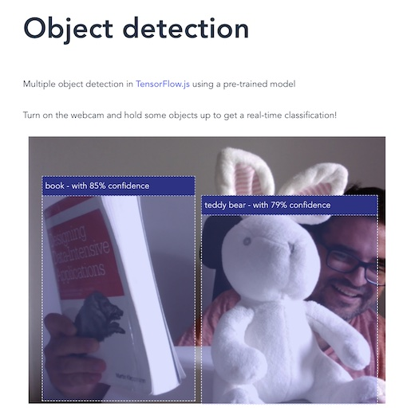

# Personal labs

This repo groups some of my personal labs.

Why do I share these small projects? my goals are:

-   learn something new by doing
-   get first hand experience with some tools / techniques
-   small and concrete objectives, do not spend more than a few days
-   not for production (do not expect many unit tests)
-   some are just for fun
-   self-contained

## Sort analysis

Implementation of the most popular [sort algorithms](https://en.wikipedia.org/wiki/Sorting_algorithm) in TypeScript. The website compares those algorithms and visualizes the intermediate steps. The animations can be paused, move forward or backwards, change speed animation, etc. These animations are implemented using a state management store with [Redux](https://redux.js.org/).

-   [Link to demo](https://sort-analysis.netlify.app/)
-   Source code: [sort-analysis](./sort-analysis/README.md)
-   Main lab goals: Manage the state with the [Redux](https://redux.js.org/); implement the most popular sort algorithm implementations; use [Material Design Web Components](https://github.com/material-components/material-web)

## Smart webcam

Automatically detect common daily objects in the webcam using Machine Learning with [Tensorflow.js](https://www.tensorflow.org/js).

-   [Link to demo](https://smart-webcam.netlify.app/)
-   Source code: [sort-analysis](./smart-webcam/README.md)
-   Main lab goals: Create a webpage that uses machine learning directly in the web browser via [Tensorflow.js](https://www.tensorflow.org/js) to classify and detect common objects.

## Sudoku resolver

This little web application resolves [Sudoku](https://en.wikipedia.org/wiki/Sudoku) problems. Just insert the values and click on 'Resolve' button.

-   [Link to demo](https://sudoku-resolver.netlify.app/)
-   Source code: [sudoku-resolver](./sudoku-resolver/README.md)
-   Main lab goals: use a [service worker](https://developer.mozilla.org/en-US/docs/Web/API/Service_Worker_API/Using_Service_Workers) for resolving the brief data-intensive computation; implement a state management store using [RxJS](https://rxjs.dev/) (without Redux).

## Snake Game

This is an implementation of the [Snake game](<https://en.wikipedia.org/wiki/Snake_(video_game_genre)>) in Vanilla HTML5/CSS and TypeScript.

-   [Link to demo](https://snake-game-lab.netlify.app/)
-   Source code: [snake-game](./snake-game/README.md)
-   Main lab goals: use JavaScript [window.requestAnimationFrame()](https://developer.mozilla.org/en-US/docs/Web/API/window/requestAnimationFrame) method to animate; use the new dialog HTML element; use the new [Vite](https://vitejs.dev/) for tooling.

