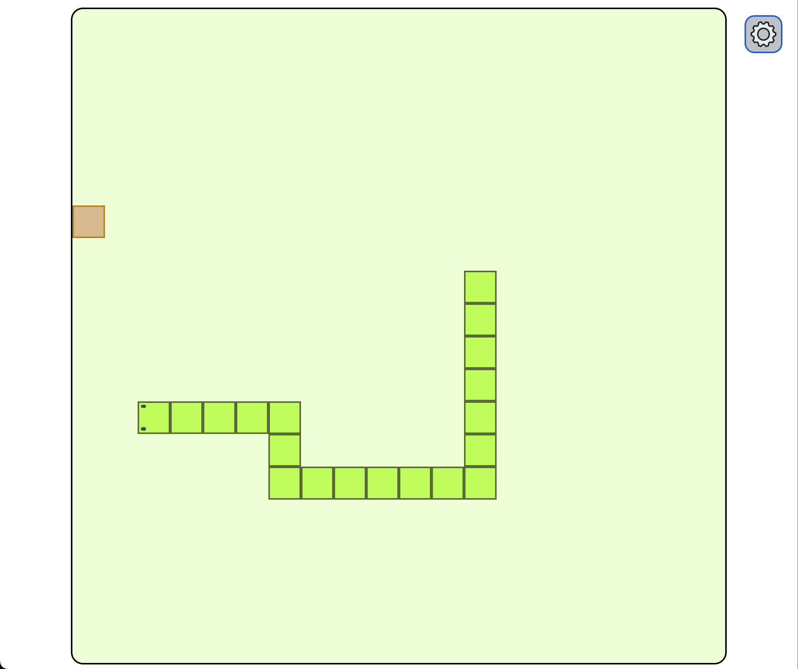

# Snake Game

This is an implementation of the [Snake game](<https://en.wikipedia.org/wiki/Snake_(video_game_genre)>) in Vanilla HTML5/CSS and TypeScript.

## Description

A CSS Grid splits the board.

The player moves the snake with the keyboard arrows. Each time the snake goes over the cookie, it grows and goes slightly faster, increasing the difficulty.

The user can configure how big the board is (number of tiles per side) and how fast the snake goes (from very slow to very fast).

<div style="text-align:center; height: 200px"></div>

## Goals of this lab

### Objectives

-   Learn how to use JavaScript to animate a Web (requirement: change the speed dinamically). Hint: use the [window.requestAnimationFrame()](https://developer.mozilla.org/en-US/docs/Web/API/window/requestAnimationFrame) method.
-   Get familiar with the new [dialog HTML element](https://developer.mozilla.org/en-US/docs/Web/HTML/Element/dialog). (requirement: open, close and style them).
-   Get some expirience with [Vite](https://vitejs.dev/) to develop and bundle the code (requirement: use TypeScript).

### Lessons learned

-   [window.requestAnimationFrame()](https://developer.mozilla.org/en-US/docs/Web/API/window/requestAnimationFrame) method is trikcy the first time you use it. The passed PRO: very well supported in all browsers. CONS. None :D
-   Dialog Element is great. PRO: customizable, nice keyboard behaviour. CONS: it is confusing how form elements close the dialog, as of today it still has some [a11y issues with the initial focus](https://github.com/whatwg/html/wiki/dialog--initial-focus,-a-proposal).
-   Not fully convinced on Vite. PRO: extremely fast, almost no configuration. CONS: I did not like Vite forces to have index.html in the root folder, [more info at official documentation](https://vitejs.dev/guide/#index-html-and-project-root).

## Commands

### Development

```bash
npm install

npm run dev
```

Browse to [http://localhost:3000/](http://localhost:3000/). Changes in code or CSS automatically update the web.

### Build

```bash
npm install

npm run build
```

The `/dist` folder contains `index.html` and hashed static files for CSS, JS and images.
