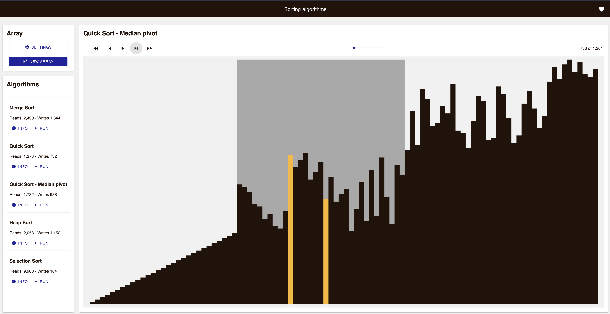

# Analysis of sort algorithms

Analysis and implementation of the most popular [sort algorithms](https://en.wikipedia.org/wiki/Sorting_algorithm) in Vanilla HTML5/CSS and TypeScript.

[Link to demo](https://sort-analysis.netlify.app/)

## Description

Steps for running a simulation:

-   The user creates an array (sorted or shuffled) of sizes from 10 to 1000.
-   The application runs the most common sort algorithms, analyzing the number of reads and writes for each algorithm.
-   The user then can select any of the sort algorithms and execute them.
-   The execution can be paused, run forward or backward, or change the speed.
-   Each line high represents the value. After sorting the array, the lines must be ordered by height.
-   The light yellow lines represent a write and the blue represent read operations. The dark grey background represents the block being sorted in that particular moment.

<div style="text-align:center; height: 200px"></div>

## Goals of this lab

### Objectives

-   Manage the complex state with the [Redux](https://redux.js.org/) state container and vanilla JS.
-   Implement the most popular sort algorithm implementations.
-   Use [Material Design Web Components](https://github.com/material-components/material-web)

### Lessons learned

-   Redux worked great for managing the application state. Especially for moving forward and rewinding the animation. The lab also uses Redux for the UI, which probably added an unneeded complexity (I would not have added to repeat it again).
-   Researching what algorithms to implement and then seeing the analysis of read/writes was a great and refreshing experience. As always, each approach has benefits and trade-offs, and it is hard to say "X algorithm" is always better.
-   Material Design Web Components work as expected. PRO: nice components that work almost out-of-the-box. CONS: installing an npm package for each component is really not ideal. If I would be responsible of this library, I would have added all of them in one package and then split each one by module export.

## Commands

### Development

```bash
yarn

yarn serve
```

Browse to [http://localhost:8080/](http://localhost:8080/). Changes in code or CSS automatically update the web.

### Build

```bash
yarn

yarn build
```

The `/dist` folder contains `index.html` and static files for CSS, JS and images.

### Unit test

Some unit tests implemented with Jest

```bash
yarn test
```
